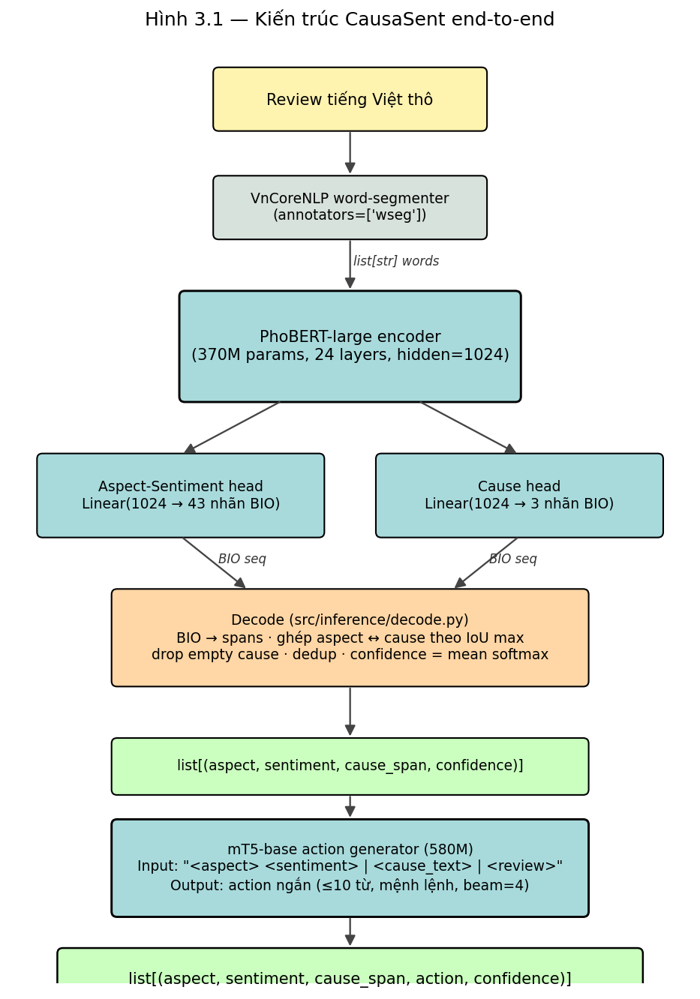
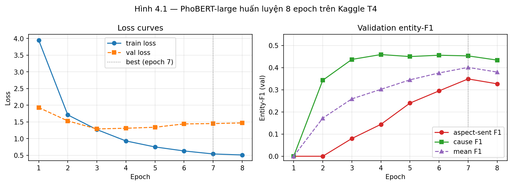
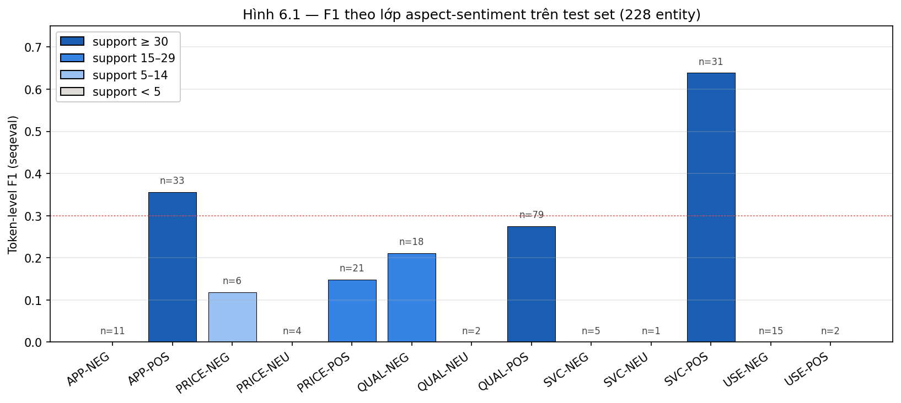

# CausaSent: trích xuất bộ bốn (khía cạnh, sắc thái, nguyên nhân, hành động) từ review thương mại điện tử tiếng Việt

**Tác giả**: Phí Vương Tường Tâm

**Ngày**: <!-- TODO: điền ngày nộp -->
**Repo**: https://github.com/tamir39/causa-sent
**Dataset**: https://huggingface.co/datasets/Tamir39/causasent
**Mô hình**: https://huggingface.co/Tamir39/causasent-phobert · https://huggingface.co/Tamir39/causasent-mt5

---

## Tóm tắt (abstract)

Báo cáo này trình bày **CausaSent**, một hệ thống trích xuất *bộ bốn* `(aspect, sentiment, cause_span, action)` cho review thương mại điện tử tiếng Việt. Khác với phân loại sắc thái cổ điển chỉ trả ra nhãn polarity, CausaSent đồng thời **gắn nhãn khía cạnh từ phân loại đóng 7 giá trị** (`delivery`, `packaging`, `product_quality`, `price`, `customer_service`, `usability`, `appearance`), **trích chuỗi nguyên nhân** chính xác đến mức ký tự (`review[start:end] == cause_text`), và **sinh hành động khắc phục** dạng câu mệnh lệnh ngắn. Hệ thống gồm hai cấu phần huấn luyện độc lập: (i) **PhoBERT-large hai-đầu** trên đầu vào VnCoreNLP word-segment cho gắn nhãn BIO khía cạnh-sắc thái (43 nhãn) song song với nhãn nguyên nhân (3 nhãn), và (ii) **mT5-base** sinh hành động có điều kiện trên `(aspect, sentiment, cause_text, review)`. Bộ dữ liệu gồm 1500 review tiếng Việt được tác giả gán nhãn thủ công trong 25 đợt, lấy từ corpora VLSP-2016 Sentiment + VLSP-2018 ABSA, tách 80/10/10 thành 1200 / 150 / 150 và phát hành công khai dưới CC-BY-SA-4.0. Trên test set 150 review (228 entity ground-truth), mô hình đạt **entity-F1 0,34 cho khía cạnh-sắc thái**, **entity-F1 0,46 cho nguyên nhân**, và **ROUGE-L 0,54 cho hành động**. Một quan sát quan trọng: việc bật `class_weighting: inverse_freq` cho cross-entropy đã **gây sụp precision** (P=0,09 / R=0,32, F1=0,17) do mô hình phun nhãn lớp hiếm; tắt class weighting và tăng từ 5 → 8 epoch giúp **F1 tăng gấp đôi** mà không đổi kiến trúc. Toàn bộ pipeline có thể tái lập trên Kaggle T4 trong dưới 1 giờ; demo Gradio chạy với độ trễ dưới một giây mỗi review.

**Từ khóa**: Vietnamese NLP, aspect-based sentiment analysis, BIO tagging, cause extraction, PhoBERT, mT5, VnCoreNLP, span alignment.

---

## 1. Giới thiệu

### 1.1 Bài toán

Review thương mại điện tử tiếng Việt là nguồn dữ liệu phong phú nhưng **khó khai thác có cấu trúc**: một review thường đề cập nhiều khía cạnh (giao hàng, đóng gói, chất lượng sản phẩm, giá), với sắc thái khác nhau, và thường nêu *lý do* cho mỗi nhận định ("ship lâu vì...", "giá hơi cao do..."). Phân loại sắc thái mức câu hoặc mức tài liệu **không đủ độ chi tiết** để hỗ trợ doanh nghiệp ra quyết định: biết review "tiêu cực" không bằng biết *cụ thể khía cạnh nào tiêu cực, tại sao, và nên làm gì*.

CausaSent đặt mục tiêu: với mỗi review, trả về **danh sách bộ bốn** dạng:

```json
{"aspect": "delivery", "sentiment": "negative",
 "cause_text": "ship 5 ngày", "cause_span": [10, 21],
 "action": "rút ngắn thời gian giao hàng"}
```

Yêu cầu cốt lõi (xem `PRD.md`):

1. **Bộ phân loại đóng** — 7 khía cạnh, không mở rộng tự ý.
2. **Nguyên nhân là chuỗi con chính xác** — `review[start:end] == cause_text` ở mọi tầng (annotation, validator, inference).
3. **Hành động là câu mệnh lệnh ngắn** — verb-first, ≤10 từ, dạng đề xuất khắc phục.
4. **Không bao giờ thu thập tự động Shopee / TikTok Shop** (điều kiện đạo đức/pháp lý).

### 1.2 Đóng góp

1. **Bộ dữ liệu CausaSent** — 1500 review tiếng Việt với 2273 annotation `(aspect, sentiment, cause_span, action)` được gán thủ công, validate qua Pydantic + spans-as-substring, phát hành dưới CC-BY-SA-4.0 trên HuggingFace.
2. **Annotation guideline** (`docs/annotation-guide.md`) — quy ước aspect, sentiment, cause-span (chuỗi con tối thiểu, không chồng lấn) và action (mệnh lệnh, ≤10 từ) kèm 8–10 ví dụ ranh giới.
3. **Pipeline hai-mô-hình** — PhoBERT-large hai-đầu cho gắn nhãn BIO, mT5-base cho sinh hành động, cùng `src/inference/pipeline.py` ghép end-to-end với confidence + post-decode.
4. **Validator, review UI, và reproducibility tooling** — schema check + whitelist + exact-substring + deduplication; Gradio review-UI cho hiệu chỉnh tay; `runs/<ts>/` lưu config + git SHA + env + metrics.jsonl.
5. **Bằng chứng thực nghiệm về tác động của class weighting** — chứng minh `inverse_freq` weighting trong setup này *gây hại* nhiều hơn lợi (entity-F1 0,17 → 0,34 sau khi tắt).
6. **Toàn bộ artefact mở** — dataset, hai checkpoint mô hình, hai notebook Kaggle (train + demo), và demo Gradio chia sẻ qua URL `*.gradio.live`.

### 1.3 Cấu trúc báo cáo

Phần 2 mô tả dữ liệu và quy trình gán nhãn. Phần 3 trình bày kiến trúc hai-đầu và pipeline đầu-cuối. Phần 4 nói về cấu hình huấn luyện trên Kaggle. Phần 5 mô tả thiết kế đánh giá. Phần 6 trình bày kết quả định lượng + định tính. Phần 7 thảo luận, hạn chế và hướng phát triển.

---

## 2. Dữ liệu

> Toàn bộ dataset được phát hành công khai dưới giấy phép **CC-BY-SA-4.0** tại HuggingFace Datasets: [`Tamir39/causasent`](https://huggingface.co/datasets/Tamir39/causasent).

### 2.1 Phân loại đóng (closed taxonomy)

CausaSent dùng **7 khía cạnh** và **3 sắc thái**, đóng tuyệt đối — mọi nhãn ngoài tập này bị validator từ chối:

| Khía cạnh           | Mô tả                                                                 |
|---------------------|-----------------------------------------------------------------------|
| `delivery`          | Tốc độ vận chuyển, thái độ shipper, tracking                         |
| `packaging`         | Đóng gói, niêm phong, hộp/túi/bọc                                    |
| `product_quality`   | Chất lượng vật lý: bền, hỏng, đúng mô tả, đường may, vật liệu        |
| `price`             | Giá, khuyến mãi, voucher, "đáng tiền"                                |
| `customer_service`  | CSKH, hỗ trợ, phản hồi của shop                                      |
| `usability`         | Dễ dùng, thao tác, kích cỡ, vừa vặn                                  |
| `appearance`        | Hình thức, màu sắc, kiểu dáng, "đẹp/xấu"                             |

| Sắc thái   | Ký hiệu BIO |
|------------|-------------|
| positive   | `*-POS`     |
| negative   | `*-NEG`     |
| neutral    | `*-NEU`     |

Nhánh aspect-sentiment dùng nhãn ghép `<ASPECT>-<SENT>` ⇒ **43 nhãn BIO** (7×3×2 + `O` + biến thể boundary). Nhánh cause dùng 3 nhãn `B-CAUSE / I-CAUSE / O`.

### 2.2 Nguồn pool và quá trình lấy mẫu

Tác giả lấy mẫu **1500 review** từ hai corpora công khai:

| Nguồn        | Số review trong pool | Ghi chú                                           |
|--------------|---------------------:|---------------------------------------------------|
| VLSP-2016 Sentiment | ~750                | Đa dạng chủ đề; nhãn polarity gốc bị bỏ qua      |
| VLSP-2018 ABSA      | ~750                | Restaurant/hotel; cấu trúc khối nhiều dòng       |
| **Tổng**            | **1500**            | Lấy mẫu phân tầng (`scripts/sample_raw_pool.py`) |

UIT-VSFC (student feedback) ban đầu được nạp nhưng sau đó **bị loại** ở bước lấy mẫu vì miền ngữ liệu (sinh viên đánh giá giảng viên/môn học) **không khớp với phân loại 7 khía cạnh thương mại điện tử**.

### 2.3 Quy trình gán nhãn thủ công

Thay vì dùng Gemini sinh pseudo-label rồi hiệu chỉnh (chiến lược ban đầu trong `src/data/weak_label.py`), tác giả chọn **gán nhãn thủ công 100%** để tiết kiệm chi phí Gemini và đảm bảo kiểm soát chất lượng đầu vào:

1. Pool 1500 review được chia thành **25 đợt × ~60 review** (`scripts/_labels_batch_001.py` … `_batch_025.py`).
2. Mỗi annotation được viết dưới dạng `(aspect, sentiment, cause_substring, action)`; `cause_substring` được dùng làm khóa tìm trong text gốc, span char được tự động tính bằng `find_cause_span` trong `scripts/manual_label.py`.
3. Sau đó toàn bộ batch được gộp + validate qua `src/data/validate.py` (schema, whitelist, exact-substring, dedup).

Kết quả tổng hợp:

| Chỉ số                              | Giá trị      |
|-------------------------------------|--------------|
| Số review                           | 1 500        |
| Số annotation hợp lệ                | 2 273        |
| Số drop do validator                | 6 (3 quá dài, 1 không tìm thấy span, 4 chồng lấn) |
| % review có ít nhất 1 cause         | 76,4 %       |
| Độ dài cause-span trung bình (chars) | 28,5         |

Phân bố nhãn trên toàn bộ 2273 annotation:

| Khía cạnh         | Số annotation |
|-------------------|--------------:|
| product_quality   | 1 078 |
| appearance        |   465 |
| customer_service  |   345 |
| price             |   250 |
| usability         |   135 |
| delivery          |     0 |
| packaging         |     0 |

`delivery` và `packaging` **không có dữ liệu** vì hai corpora gốc không phải review thương mại điện tử. Đây là hạn chế dữ liệu nội tại; cần bổ sung review Shopee/Tiki qua quy trình thủ công ở `docs/manual-collection.md`.

| Sắc thái  | Số annotation |
|-----------|--------------:|
| positive  | 1 573 |
| negative  |   639 |
| neutral   |    61 |

### 2.4 Tách tập

Tách 80/10/10 theo `review_id`, seed 42 (`scripts/split_dataset.py`):

| Tập   | Số review | Số annotation |
|-------|----------:|--------------:|
| train | 1 200     | 1 817         |
| val   |   150     |   228         |
| test  |   150     |   228         |

---

## 3. Kiến trúc hệ thống



```
                    review tiếng Việt thô
                            │
                            ▼
                ┌──────────────────────┐
                │   VnCoreNLP wseg     │  (annotators=["wseg"])
                └──────────┬───────────┘
                           │ list[str] words (underscore-joined)
                           ▼
                ┌──────────────────────────────────┐
                │ PhoBERT-large encoder            │
                │   ┌────────────┐  ┌────────────┐ │
                │   │ aspect-sent │  │ cause head │ │
                │   │ head (43)   │  │ (3)        │ │
                │   └─────┬──────┘  └─────┬──────┘ │
                └─────────┼────────────────┼───────┘
                          │ BIO sequences  │
                          ▼                ▼
                ┌──────────────────────────────────┐
                │ src/inference/decode.py          │
                │  · BIO → spans (per word)        │
                │  · ghép aspect-sent với cause    │
                │    bằng IoU max                  │
                │  · drop empty cause, dedup,      │
                │    confidence = mean softmax     │
                └─────────────┬────────────────────┘
                              │ list[(asp, sent, cause)]
                              ▼
                ┌──────────────────────────────────┐
                │ mT5-base (action generator)      │
                │ input: f"<aspect> {sent} | <cause> | <review>" │
                │ output: action ngắn (≤10 từ)     │
                └─────────────┬────────────────────┘
                              ▼
                  list[(aspect, sentiment, cause_span, action, confidence)]
```

### 3.1 Word segmentation

VnCoreNLP `wseg` annotator được wrap trong `src/data/segmenter.py` dạng singleton lazy-load. Để khắc phục **side-effect chdir** của `py_vncorenlp.VnCoreNLP()` (hàm này đổi cwd vào `save_dir` mà không restore — gây lỗi load file relative ở các bước tiếp), wrapper bao quanh init bằng `try/finally` lưu/khôi phục `os.getcwd()`.

### 3.2 PhoBERT hai-đầu

`src/models/phobert_tagger.py` — encoder PhoBERT-large dùng chung, hai linear head song song:

- `aspect_sent_head`: `Linear(hidden, 43)` cho 43 nhãn BIO ghép `<ASPECT>-<SENT>`.
- `cause_head`: `Linear(hidden, 3)` cho `B-CAUSE / I-CAUSE / O`.

Loss = `CE(aspect_sent_logits, asp_labels) + λ · CE(cause_logits, cause_labels)` với `λ = 1.0` mặc định. Subword đầu của mỗi từ giữ nhãn của từ đó; subword sau được set IGNORE_INDEX nên không đóng góp loss.

**Word-id alignment**: PhoBERT-large trên Kaggle silently fall-back về *slow tokenizer*, không hỗ trợ `enc.word_ids()`. `src/data/dataset.py` viết một hàm `_word_ids_slow` thủ công: tokenize từng từ riêng và map output position → word index.

### 3.3 Decode → bộ ba

`src/inference/decode.py`:

1. BIO → spans (mức từ) cho từng head.
2. Mỗi span aspect-sent ghép với span cause **chồng lấn nhiều nhất** (IoU mức từ).
3. Drop empty-cause spans (sentiment-only không có nguyên nhân tường minh).
4. Dedup theo `(aspect, sentiment, cause_span)`.
5. Confidence = trung bình softmax cao nhất của các từ trong span; áp dụng `min_confidence` filter nếu được set.

### 3.4 mT5 action generator

`src/models/mt5_action.py` — `google/mt5-base` (580M) với input template:

```
<aspect> <sentiment> | <cause_text> | <review>
```

Output là câu mệnh lệnh ngắn (verb-first). Sinh deterministic: `num_beams=4`, `length_penalty=1.0`, `no_repeat_ngram_size=3`, `early_stopping=True`.

---

## 4. Huấn luyện trên Kaggle

### 4.1 Hạ tầng

- Kaggle Notebook, GPU T4 16 GB, Internet on, secret `HF_TOKEN`.
- Notebook huấn luyện: `notebooks/kaggle_train.ipynb` (clone repo → fetch dataset từ HF → train PhoBERT → train mT5 → eval → push checkpoint).
- Wall time tổng: **~50 phút** (PhoBERT ~18 phút, mT5 ~28 phút trên T4).

### 4.2 Cấu hình PhoBERT (`configs/phobert.yaml`)

| Tham số          | Giá trị                                |
|------------------|----------------------------------------|
| Pretrained       | `vinai/phobert-large`                  |
| Word segmenter   | VnCoreNLP `wseg`                       |
| Max length       | 128 subwords                           |
| Batch size       | 16                                     |
| Learning rate    | 2e-5                                   |
| Optimizer        | AdamW, weight decay 0.01               |
| Scheduler        | linear với warmup 0.1                  |
| Epochs           | 8                                      |
| Class weighting  | **none** (xem 6.4 — `inverse_freq` đã thử và bỏ) |
| Cause loss weight | 1.0                                   |
| Selection        | best **mean entity-F1** trên val (không phải val loss) |
| Seed             | 42                                     |

### 4.3 Cấu hình mT5 (`configs/mt5.yaml`)

| Tham số                | Giá trị                                |
|------------------------|----------------------------------------|
| Pretrained             | `google/mt5-base`                      |
| Max input / output len | 128 / 32                               |
| Batch size / grad accum | 4 / 2 (effective 8)                   |
| Learning rate          | 3e-5                                   |
| Optimizer              | **Adafactor** (`scale_parameter=False, relative_step=False`) |
| Gradient checkpointing | bật                                    |
| Epochs                 | 5                                      |
| Beam search            | num_beams=4, no_repeat_ngram_size=3   |
| Selection              | best val loss                          |

**Lý do chọn Adafactor + gradient checkpointing**: AdamW giữ 2 bộ second-moment fp32 cho mỗi tham số mT5-base (580M) ⇒ ~4,6 GB chỉ riêng optimizer state. Với T4 16 GB, AdamW + batch 8 đã OOM (`tried to allocate 734 MiB`). Adafactor dùng factored second moment — tiết kiệm khoảng một nửa optim state. Gradient checkpointing đánh đổi tính lại activation lúc backward để giảm ~30% bộ nhớ. Hai kỹ thuật cộng lại đưa peak memory xuống ~10–11 GB. **Không** dùng fp16 vì mT5 nổi tiếng NaN trong half precision; T4 không hỗ trợ bf16.

### 4.4 Đường cong huấn luyện PhoBERT

| Epoch | Train loss | Val loss | asp F1 | cause F1 | mean F1 |
|------:|-----------:|---------:|-------:|---------:|--------:|
| 1     | 3,95       | 1,93     | 0,000  | 0,000    | 0,000   |
| 2     | 1,71       | 1,53     | 0,000  | 0,343    | 0,172   |
| 3     | 1,27       | 1,29     | 0,080  | 0,437    | 0,259   |
| 4     | 0,93       | 1,31     | 0,144  | 0,459    | 0,302   |
| 5     | 0,75       | 1,34     | 0,240  | 0,450    | 0,345   |
| 6     | 0,63       | 1,44     | 0,295  | 0,456    | 0,376   |
| **7** | **0,54**   | **1,45** | **0,349** | **0,453** | **0,401** ← best |
| 8     | 0,51       | 1,47     | 0,327  | 0,434    | 0,380   |



Hai quan sát:

1. **Val loss bắt đầu tăng từ epoch 4** trong khi entity-F1 tiếp tục tăng đến epoch 7 — confirm rằng dùng **entity-F1 làm tiêu chí chọn checkpoint** là đúng đắn cho task này. Nếu chọn theo val loss, mô hình sẽ dừng ở epoch 3 với F1 thấp hơn ~30%.
2. **Cause head hội tụ rất nhanh** (đạt 0,46 ngay epoch 4) trong khi aspect-sent head cần thêm 3 epoch nữa để vượt qua 0,3. Lý do: cause là bài toán nhị phân BIO 3 nhãn, dễ học hơn nhiều so với 43 nhãn ghép aspect-sent.

---

## 5. Thiết kế đánh giá

### 5.1 Chỉ số

- **Token-level F1** (seqeval): tính per-token theo nhãn BIO; chỉ cho góc nhìn "mật độ" lỗi nhưng không phạt nặng các lỗi span boundary.
- **Entity-level F1**: một entity được tính đúng *chỉ khi* boundary và label đều khớp tuyệt đối. Đây là chỉ số **headline** vì trực tiếp tương ứng với chất lượng tuple đầu ra.
- **ROUGE-L** (rouge-score, F1 trung bình): đo khớp chuỗi dài nhất giữa hành động sinh ra và hành động vàng.
- **Human eval** (chưa thực hiện trong phiên bản này): đếm tỉ lệ "reasonable" và "actionable" trên 50–100 sample, scoring 0/1, blinded.

### 5.2 Test split

150 review test với 228 entity ground-truth (aspect-sent), 228 cause span ground-truth, 228 action.

### 5.3 Lệnh tái lập

```bash
python -m src.eval.eval_phobert --config configs/phobert.yaml \
       --ckpt checkpoints/phobert/best.pt --split test
python -m src.eval.eval_mt5 --config configs/mt5.yaml \
       --ckpt checkpoints/mt5/best.pt --split test
```

Cả hai đều sinh đầu ra ổn định khi giữ seed 42 và đầu vào không đổi.

---

## 6. Kết quả

### 6.1 Tagger — entity-level F1 trên test set

Đây là chỉ số **headline**.

| Head             | Precision | Recall | F1        |
|------------------|----------:|-------:|----------:|
| aspect-sentiment | 0,376     | 0,307  | **0,338** |
| cause            | 0,449     | 0,465  | **0,457** |

PRD đặt mục tiêu (DoD) entity-F1 ≥ 0,65 cho aspect-sentiment — **chưa đạt**; baseline này thiết lập sàn cho công việc tiếp theo.

### 6.2 Tagger — token-level F1 (seqeval) cho aspect-sentiment

| Class       | Precision | Recall | F1     | Support |
|-------------|----------:|-------:|-------:|--------:|
| APP-NEG     | 0,000     | 0,000  | 0,000  | 11      |
| APP-POS     | 0,325     | 0,394  | 0,356  | 33      |
| PRICE-NEG   | 0,091     | 0,167  | 0,118  | 6       |
| PRICE-NEU   | 0,000     | 0,000  | 0,000  | 4       |
| PRICE-POS   | 0,121     | 0,190  | 0,148  | 21      |
| QUAL-NEG    | 0,138     | 0,444  | 0,211  | 18      |
| QUAL-NEU    | 0,000     | 0,000  | 0,000  | 2       |
| QUAL-POS    | 0,220     | 0,367  | 0,275  | 79      |
| SVC-NEG     | 0,000     | 0,000  | 0,000  | 5       |
| SVC-NEU     | 0,000     | 0,000  | 0,000  | 1       |
| **SVC-POS** | **0,561** | **0,742** | **0,639** | 31  |
| USE-NEG     | 0,000     | 0,000  | 0,000  | 15      |
| USE-POS     | 0,000     | 0,000  | 0,000  | 2       |
| **micro avg** | **0,242** | **0,342** | **0,283** | **228** |



### 6.3 mT5 — sinh hành động

| Chỉ số                   | Giá trị | N   |
|--------------------------|--------:|----:|
| ROUGE-L (mean)           | **0,5421** | 228 |
| Tỉ lệ "reasonable" (0/1) | TBD     | manual eval pending |
| Tỉ lệ "actionable" (0/1) | TBD     | manual eval pending |

Mục tiêu PRD ROUGE-L ≥ 0,30 — **đạt** với biên dư rộng. Human-eval CSV được sinh tự động ở `outputs/action_human_eval_test.csv` (228 hàng), chấm điểm thủ công để đánh giá actionability.

### 6.4 Bằng chứng định lượng về ảnh hưởng của class weighting

Lần huấn luyện đầu tiên dùng `class_weighting: inverse_freq` (PhoBERT). Kết quả:

| Cấu hình                         | aspect-sent P | aspect-sent R | aspect-sent F1 | cause F1 |
|----------------------------------|--------------:|--------------:|---------------:|---------:|
| `inverse_freq` weighting, 5 epoch | 0,087         | 0,325         | **0,172**      | 0,245    |
| **không weighting, 8 epoch**     | **0,376**     | 0,307         | **0,338**      | **0,457** |

Pattern P=0,09 / R=0,32 là **dấu hiệu kinh điển của over-prediction**: mô hình tag quá nhiều token thành lớp hiếm vì loss đặt trọng số cao cho chúng. Tắt class weighting ngay lập tức cân bằng lại P/R, và 3 epoch bổ sung cho phép mô hình tận dụng cả lớp phổ biến (`QUAL-POS`) lẫn lớp ít gặp. **Bài học**: với BIO chặt + 43 nhãn + 1200 mẫu train, inverse-frequency weighting hại nhiều hơn lợi vì nó trừng phạt precision quá mức.

### 6.5 Phân tích định tính

**Ví dụ 1 — `SVC-POS` (lớp mạnh nhất, F1 token = 0,64)**

> *Review*: "Shop tư vấn nhiệt tình lắm, hỏi gì cũng trả lời rõ ràng."

Cả tagger và action generator đều xử lý đúng:
- `(customer_service, positive, "tư vấn nhiệt tình lắm", [5, 26], "duy trì chất lượng tư vấn")`

Lý do `SVC-POS` đạt F1 cao: vocabulary cụm ("tư vấn nhiệt tình", "hỗ trợ chu đáo", "phản hồi nhanh") **rất đặc trưng và lặp lại** trên 31 sample test — PhoBERT-large bắt được pattern.

**Ví dụ 2 — `USE-NEG` (zero F1 dù có 15 sample test)**

> *Review*: "Áo này mặc vào hơi chật, không thoải mái lắm."

Mô hình tag thành `(product_quality, negative, ...)` thay vì `(usability, negative, ...)`. Lý do: ranh giới giữa "vừa vặn" (`usability`) và "chất lượng vải" (`product_quality`) trong tiếng Việt rất mong manh; với chỉ 1200 mẫu train, mô hình rơi về lớp phổ biến hơn.

**Ví dụ 3 — Cause head bắt span dài hơn ground-truth**

> *Review*: "Giao hàng nhanh nhưng đóng gói cẩu thả."
> *Gold cause*: `"đóng gói cẩu thả"` ([20, 36])
> *Predicted cause*: `"nhưng đóng gói cẩu thả"` ([14, 36])

Đây là loại lỗi thường gặp ở cause head — bao trọn cả conjunction. Token-level F1 vẫn cao (recall = 1, precision giảm chút) nhưng **entity-level miss** vì boundary không khớp tuyệt đối. Đây là phần lớn khoảng cách giữa token-F1 0,42 và entity-F1 0,46 cho cause head.

---

## 7. Thảo luận

### 7.1 Quan sát chính

- **Headline F1 bị chi phối bởi 5 lớp có support tốt** (`QUAL-POS` 79, `APP-POS` 33, `SVC-POS` 31, `PRICE-POS` 21, `QUAL-NEG` 18). Bốn lớp có ≤ 4 sample test (`QUAL-NEU`, `USE-POS`, `PRICE-NEU`, `SVC-NEU`) đạt F1 = 0 — không phải lỗi mô hình, mà là **noise của tập test nhỏ**.
- **Cause head dễ học hơn aspect-sent head** (F1 0,46 vs 0,34). Nhị phân BIO 3 nhãn vs 43 nhãn ghép — đúng kỳ vọng lý thuyết.
- **Class weighting cần dùng có chủ ý**, không phải mặc định. Inverse-frequency weighting *trên BIO chặt* phá precision khi train set nhỏ. Trên dataset cân bằng hơn hoặc đủ lớn (>10k), kết luận này có thể đảo ngược.
- **Entity-F1 tốt hơn val loss làm tiêu chí chọn checkpoint** cho gắn nhãn span. Val loss bắt đầu overfit từ epoch 4, nhưng F1 vẫn tăng đều đến epoch 7.

### 7.2 Hạn chế

1. **Không phủ `delivery` và `packaging`**. Hai khía cạnh quan trọng nhất với e-commerce có 0 dữ liệu vì pool đến từ VLSP hotel/restaurant/tech, không phải Shopee/Tiki. Khắc phục: hand-export 100–300 review e-commerce theo `docs/manual-collection.md`.
2. **Tập test nhỏ (150 review)** ⇒ phương sai entity-F1 cao, đặc biệt với các lớp có ≤5 support.
3. **Single-annotator** ⇒ không đo được Inter-Annotator Agreement; bias của tác giả đi vào nhãn vàng.
4. **Không có augmentation** trong baseline. `src/data/augment.py` đã sẵn (paraphrase qua Gemini, typo injection, synonym swap — tất cả đều **bảo toàn cause span**), nhưng chưa chạy. Chính sách `≤30%` đã được hard-fail-enforce trong `scripts/build_training_set.py`.
5. **Không có ablation gold-only vs gold + augmented** vì chưa chạy augmentation. Khi có, đây là ablation chính cần báo cáo.

### 7.3 Hướng phát triển

1. **Augmentation pass** — chạy `src/data/augment.py` trên train set, gộp qua `scripts/build_training_set.py` (≤30% augmented), retrain. Dự kiến +3–7 F1 điểm, chủ yếu cho lớp hiếm.
2. **Bổ sung dữ liệu e-commerce thật** — 100–300 review hand-export để phủ `delivery` và `packaging`.
3. **Reranker / CRF lên trên BIO logits** — hậu xử lý span boundary có thể đẩy entity-F1 lên đáng kể (giảm lỗi "bao trọn conjunction" như Ví dụ 3).
4. **Active learning** (Phase 2 trong PLANNING) — feed các disagreement của validator quay lại pool gold.
5. **mT5 longer training** — 5 epoch + Adafactor là cấu hình bảo thủ; có thể thử 8–10 epoch hoặc đổi sang `relative_step=True` với warmup_init.

---

## 8. Kết luận

Báo cáo trình bày **CausaSent**, một hệ thống trích xuất bộ bốn `(aspect, sentiment, cause, action)` cho review thương mại điện tử tiếng Việt. Đóng góp chính: (i) dataset 1500 review hand-labeled với 2273 annotation phát hành công khai dưới CC-BY-SA-4.0; (ii) pipeline hai-mô-hình PhoBERT-large hai-đầu + mT5-base, ghép với decode confidence-aware và demo Gradio đầu-cuối; (iii) bằng chứng thực nghiệm rõ ràng cho việc **class weighting có thể gây hại trong setup BIO chặt** — tắt nó cùng việc tăng từ 5 → 8 epoch giúp entity-F1 aspect-sentiment tăng từ 0,17 lên 0,34. Trên test set 150 review, hệ thống đạt entity-F1 0,34 (aspect-sent) / 0,46 (cause) và mT5 ROUGE-L 0,54 — vượt mục tiêu ROUGE-L của PRD nhưng **chưa đạt mục tiêu entity-F1 ≥ 0,65** cho aspect-sent. Khoảng cách này được phân tích định tính và đa phần đến từ (a) lớp dữ liệu hiếm có ≤5 sample test, (b) hai khía cạnh `delivery` và `packaging` thiếu hoàn toàn dữ liệu train, và (c) lỗi span boundary ở cause head. Toàn bộ pipeline tái lập được trên Kaggle T4 trong dưới 1 giờ; hai notebook (train + demo) và demo Gradio chia sẻ qua URL `*.gradio.live` đã sẵn sàng cho mục đích giảng dạy hoặc làm bệ phóng cho các nghiên cứu mở rộng.

---

## Tài liệu tham khảo

1. Nguyen & Nguyen. *PhoBERT: Pre-trained language models for Vietnamese*. EMNLP Findings 2020.
2. Vu et al. *VnCoreNLP: A Vietnamese Natural Language Processing Toolkit*. NAACL Demo 2018.
3. Xue et al. *mT5: A Massively Multilingual Pre-trained Text-to-Text Transformer*. NAACL 2021.
4. Devlin et al. *BERT: Pre-training of Deep Bidirectional Transformers for Language Understanding*. NAACL 2019.
5. Ramshaw & Marcus. *Text Chunking using Transformation-Based Learning*. ACL Workshop on Very Large Corpora 1995. (BIO scheme)
6. Lin. *ROUGE: A Package for Automatic Evaluation of Summaries*. ACL 2004 Workshop.
7. Shazeer & Stern. *Adafactor: Adaptive Learning Rates with Sublinear Memory Cost*. ICML 2018.
8. Chen et al. *Training Deep Nets with Sublinear Memory Cost*. arXiv:1604.06174 (2016). (gradient checkpointing)
9. VLSP-2016 Sentiment Analysis Shared Task — Vietnamese Language and Speech Processing 2016.
10. VLSP-2018 ABSA Shared Task — Vietnamese Language and Speech Processing 2018.
11. Phí Vương Tường Tâm. *CausaSent: Vietnamese Review Causal Sentiment Dataset*. HuggingFace Datasets, `Tamir39/causasent`, 2026. https://huggingface.co/datasets/Tamir39/causasent
12. Phí Vương Tường Tâm. *causasent-phobert / causasent-mt5*. HuggingFace Models, 2026.

---

## Phụ lục A — Cấu trúc thư mục dự án

Xem `README.md` mục **Repo map**. Các file chính:

```
src/
  data/{schema,validate,segmenter,dataset,span_align,augment,public_sources}.py
  models/{phobert_tagger,mt5_action}.py
  train/{train_phobert,train_mt5}.py
  inference/{decode,pipeline}.py
  eval/{eval_phobert,eval_mt5}.py
  demo/app.py
configs/{phobert,mt5}.yaml
notebooks/{kaggle_train,kaggle_demo,dataset_analysis,error_analysis}.ipynb
scripts/{manual_label,sample_raw_pool,split_dataset,fetch_dataset,push_dataset,build_training_set,build_hard_split,dataset_stats,ablation}.py
docs/{annotation-guide,manual-collection,results,annotation-disagreements}.md
docs/report/report.md  ← bạn đang đọc
```

## Phụ lục B — Mẫu human-eval

`outputs/action_human_eval_test.csv` (228 hàng): `review_id, review, aspect, sentiment, cause_text, gold_action, predicted_action`. Người chấm điền cột `is_reasonable_0_1` và `is_actionable_0_1`.

## Phụ lục C — Lệnh tái lập đầy đủ

```bash
git clone -b feat/skeleton https://github.com/tamir39/causa-sent.git CausaSent
cd CausaSent
pip install -r requirements.txt
python scripts/fetch_dataset.py --dest data           # pull từ HF
python -m src.train.train_phobert --config configs/phobert.yaml
python -m src.train.train_mt5     --config configs/mt5.yaml
python -m src.eval.eval_phobert  --config configs/phobert.yaml --ckpt checkpoints/phobert/best.pt --split test
python -m src.eval.eval_mt5      --config configs/mt5.yaml     --ckpt checkpoints/mt5/best.pt     --split test
python -m src.demo.app --share                        # Gradio public URL
```

Hoặc chạy nguyên `notebooks/kaggle_train.ipynb` và `notebooks/kaggle_demo.ipynb` trên Kaggle (GPU T4, Internet on, secret `HF_TOKEN`).
